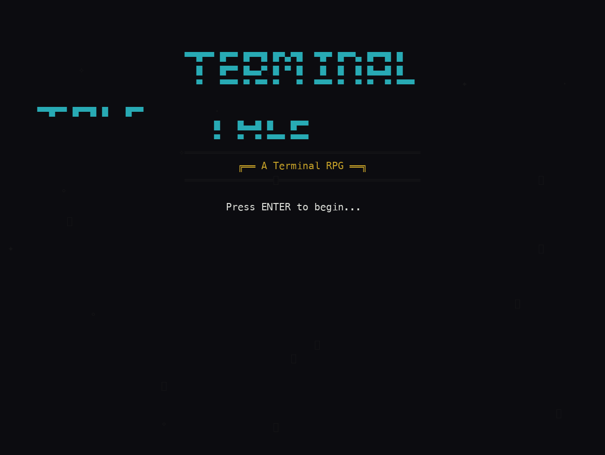
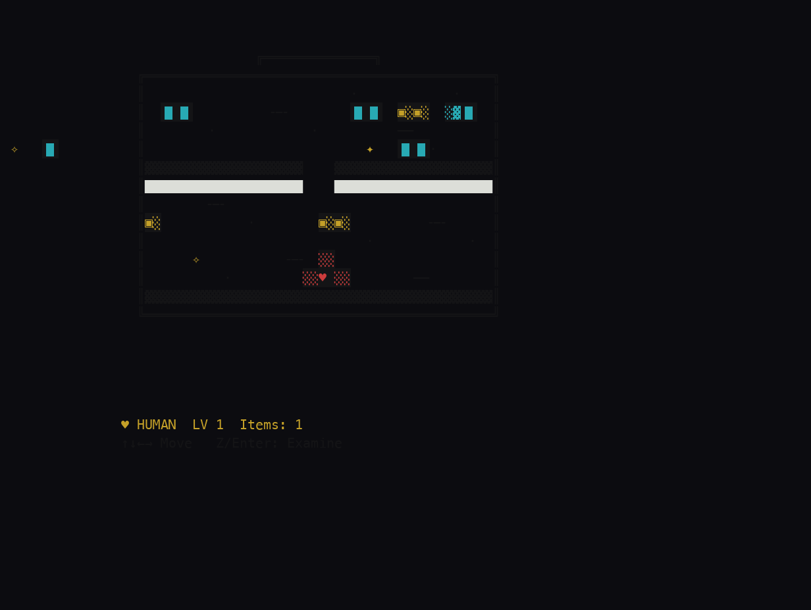

<div align="center">



# 💛 Terminal Tale

**Un RPG de terminal estilo Undertale: esquiva los ataques con tu corazón.**


</div>

---

## 💛 Qué es esto

Terminal Tale es un RPG por turnos con combate **bullet-hell** inspirado en Undertale, jugado por completo en la terminal. Exploras un complejo de servidores y te enfrentas a TERMINUS, un monitor sentiente que solía ser una interfaz gráfica. En combate, mueves tu corazón dentro de una caja de esquive para evitar los patrones de ataque, y eliges entre **ACT** (perdonar) y **FIGHT** (luchar) al más puro estilo Undertale.

El jefe tiene un sprite expresivo que cambia de cara según el momento del combate, hay barras de HP y de ataque, frames de invulnerabilidad tras recibir daño, y —lo más sorprendente para una terminal— **audio generado en tiempo real** mediante síntesis de ondas WAV, con reproducción multiplataforma. Todo en arte ASCII a todo color.

## 📖 La historia

> Entras en una terminal oscura. El cursor parpadea en el vacío... y un monitor cobra vida. TERMINUS te observa: antes era una GUI hermosa, llena de botones y menús desplegables, y ahora está condenado a renderizar caracteres de dibujo de cajas. Quizá aplastarte le haga sentir mejor. ¿Lucharás contra él o encontrarás la forma de perdonarlo?

## 🎮 Cómo se juega

| Tecla | Acción |
|---|---|
| Flechas | Mover el corazón en la caja de esquive / navegar menús |
| `Enter` / `Espacio` / `Z` | Confirmar (ACT, FIGHT, opciones) |
| Flechas + tempo | En FIGHT, sincroniza tu golpe con la barra de ataque |
| `Q` / `Esc` | Salir |

## 🚀 Cómo ejecutar

```bash
git clone https://github.com/gavilanbe/terminal-tale.git
cd terminal-tale
python3 terminal_tale.py
```

Requiere Python 3.8+ y una terminal de al menos 80x30 con soporte Unicode.

## 📸 Captura



## 🛠️ Bajo el capó

- Python 3.8+ con la librería estándar `curses` (sin dependencias externas).
- Síntesis de audio procedural con `wave` + `struct` (ondas cuadrada, seno y triángulo) y reproducción multiplataforma (`afplay` / `aplay`).
- Combate bullet-hell con caja de esquive, frames de invulnerabilidad y menús ACT / FIGHT.
- Jefe con sprite expresivo y arte ASCII a todo color con múltiples pares de color de `curses`.

## 📦 Créditos

Parte de mi colección de juegos. Publicado por [**@gavilanbe**](https://github.com/gavilanbe).

## 📄 Licencia

[MIT](LICENSE)
